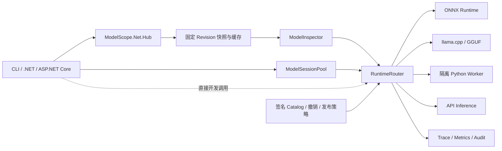

# ModelScope.Net

ModelScope.Net 是 [ModelScope](https://github.com/modelscope/modelscope) 的 **.NET 版本**，面向 **.NET 10** 提供 Hub 客户端与多运行时推理解决方案。它提供模型查询、固定版本下载、完整性校验、离线缓存、能力检测和统一推理接口，并按模型特征将请求路由到 ONNX Runtime、llama.cpp、隔离的 Python Worker 或 ModelScope API Inference。

项目采用“**原生能力优先、Python 生态兜底、生产环境默认拒绝未通过生产技术认证的模型**”的设计，而不是把 ModelScope Python 生态逐行改写为 C#。

> [!IMPORTANT]
> 当前版本为 `0.1.0-preview.1` 技术预览。本机 macOS ARM64/CPU 工程候选已通过 260 项 .NET 测试和若干固定模型的技术验证，但**没有任何模型可据此视为已获生产发布批准**。生产 1.0 仍是 NO-GO：真实私有仓库、目标 Windows/Linux/GPU、许可证批准、远程 CI、生产可信存储、7 天 Hub SLO 和 72 小时稳定性测试尚未全部完成。详见[最终验收复核](docs/final-acceptance-2026-09-08.md)。

## 15 分钟首次成功路径

网络正常且已安装 .NET 10 SDK 时，可先用公开模型验证“构建 → Hub 查询 → 固定 Revision”主链路；这一步不下载权重，也不代表模型推理或生产认证：

```bash
dotnet restore ModelScope.Net.sln
dotnet build ModelScope.Net.sln --configuration Release --no-restore
dotnet run --project src/ModelScope.Net.Cli -- \
  info BAAI/bge-small-en-v1.5 --revision master
dotnet run --project src/ModelScope.Net.Cli -- \
  resolve BAAI/bge-small-en-v1.5 --revision master
```

成功时，最后一条命令会返回一个 40 位 Commit。随后可继续完成[固定快照下载、能力检测和首次 ONNX 推理](#cli-快速开始)。实际耗时取决于首次恢复依赖和网络速度。

## 适用场景

ModelScope.Net 适合以下需求：

- 在 .NET 应用中查询 ModelScope 模型、解析分支或标签并下载固定 Commit 快照；
- 在本地使用已经逐模型完成技术验证的 ONNX 或 GGUF 模型；
- 通过独立 Python Worker 调用 ModelScope Pipeline、PyTorch、Transformers 或 Diffusers 模型；
- 调用支持 API Inference 的远程模型；
- 在 ASP.NET Core 宿主中统一管理依赖注入、健康检查、Session 缓存、并发、审计和 OpenTelemetry；
- 对模型版本、制品摘要、运行时、任务和平台执行签名发布门禁、灰度、回滚及撤销。

当前不以以下能力为目标：

- 用纯 .NET 直接运行任意 ModelScope 社区模型；
- 迁移训练、微调、数据集、模型上传或完整 Hub 管理功能；
- 自动信任模型仓库中的 Python 代码；
- 在未认证平台上根据 CPU 结果推断 GPU/CUDA 兼容性或性能。

## 核心能力

| 能力域 | 已支持功能 | 当前边界 |
|---|---|---|
| ModelScope Hub | 模型详情、分支/标签列表、Revision 固定为 40 位 Commit、文件列表、单文件与快照下载 | 真实私有/受限仓库尚未完成生产验收 |
| 下载可靠性 | 重试、Range 续传、SHA-256、进度、取消、并发限制、`allow`/`ignore` 过滤 | 7 天/至少 2000 次在线 SLO 尚未执行 |
| 缓存与离线 | Blob/Snapshot/Manifest、原子发布、多进程互斥、离线复用、缓存扫描和校验 | 缓存不是模型授权或许可证证明 |
| 模型检测 | ONNX、GGUF、SafeTensors、PyTorch、TensorFlow、Llamafile、OpenVINO、Python 代码；架构、任务、远程代码和简单许可证/依赖诊断 | 复杂 SPDX、通用环境求解和真实 RAM/VRAM 预测仍需人工/实测 |
| ONNX | 原始张量、Embedding、文本分类、图像分类、YOLO 目标检测、decoder-only 贪心文本生成 | 仅 CPU 路径；无 CUDA EP、任意 Tokenizer 或任意生成图承诺 |
| GGUF | 有界 Header 解析、架构/量化白名单、llama-server 管理、普通/流式生成、Embedding、崩溃恢复 | Qwen2.5 文本生成与 bge-base Q4_K_M Embedding 均仅本机 macOS ARM64 CPU 技术验证 |
| Python Worker | gRPC 主协议、HTTP/SSE 兼容协议、模型加载/调用/流式/卸载、进程恢复、回环鉴权和 mTLS | 模型依赖按模型族构建；不提供“万能”基础环境 |
| Remote | OpenAI 兼容普通与 SSE 调用、Bearer Token、错误分类和正文脱敏 | API 配额与模型支持由远程服务决定 |
| 生产路由 | 开发/生产模式、签名 Catalog、制品复核、任务绑定、撤销、灰度和回滚 | 生产防回退控制面及多副本分发尚未验收 |
| 资源治理 | 预热、Session 复用、LRU、全局/单模型并发、有限队列、超时、估算内存准入 | 估算值不是操作系统强制内存或显存限制 |
| 可观测性 | Trace、调用/失败/耗时指标、安全审计、Grafana Dashboard、Prometheus 告警 | 下载、排队、内存/GPU、Worker 重启和远程额度指标尚未覆盖 |
| 部署 | Linux CPU/GPU Kustomize、安全上下文、NetworkPolicy、资源配额、Windows CPU 拒绝策略 | 目标 x64/GPU 集群和当前镜像供应链仍待验证 |

## 系统架构



`ModelInspector` 只检测能力，不执行模型代码；`RuntimeRouter` 根据能力状态和运行策略选择运行时。在生产模式下，模型 ID、Commit、任务、平台、运行时摘要和制品 Hash 必须与签名认证精确匹配。

## 已完成本机技术验证的模型与任务

下表表示仓库中已经存在真实模型或金标准证据，不表示同系列其他模型自动兼容，也不表示许可证、安全、目标平台或生产发布已经批准。

| 模型（固定 Revision） | 任务 | 运行时 | 本机验证证据 |
|---|---|---|---|
| `BAAI/bge-small-en-v1.5@160f4d…` | Sentence Embedding，CLS Pooling | ONNX CPU | 8×384，Python/.NET 数值对照 |
| `unsloth/all-MiniLM-L6-v2@4bc149…` | Sentence Embedding，Mean Pooling | ONNX CPU | 8×384，Python/.NET 数值对照 |
| `distilbert/...-sst-2-english@ef2f51…` | 文本分类 | ONNX CPU | 8 样本标签完全一致 |
| `onnx-community/mobilenet_v2_1.0_224-ONNX@ba6621…` | 图像分类 | ONNX CPU | 3 样本 Top-1/Top-5 对照；许可证待审批 |
| `Qwen/Qwen2.5-0.5B-Instruct-GGUF@2e50b7…` | 文本生成 | GGUF / llama.cpp CPU | macOS ARM64 普通、流式、崩溃恢复 |
| `onnx-community/SmolLM-135M-ONNX@cde455…` | 贪心文本生成 | ONNX CPU | 3 提示词 token/text 精确一致，8 data + 1 done |
| `AI-ModelScope/stable-diffusion-v1-5@50b8f0…` | 文生图 | Python Worker CPU | 本机固定输入/输出与恢复；许可证待审批 |
| `damo/cv_convnextTiny_ocr-recognition-general_damo@634646…` | OCR 识别 | Python Worker CPU | 本机真实模型结果验证；许可证待审批 |
| `damo/cv_resnet18_ocr-detection-db-line-level_damo@3a6b98…` | OCR 检测 | Python Worker CPU | 本机真实模型结果验证；许可证待审批 |
| `iic/speech_paraformer-...@ff922d…` | 中文语音识别 | Python Worker CPU | 16 kHz PCM16 WAV 官方样本；许可证待审批 |

`Qwen/Qwen2.5-0.5B-Instruct@186d85…` 还通过了固定 Commit 下载验证，但不据此声明本地推理认证。表中的 Revision 为便于阅读而缩写；[`release-manifest-v1.yaml`](release-manifest-v1.yaml) 中的完整 40 位 Revision、SHA-256、数值门槛和证据路径才是权威记录。该清单仍为 `draft`，其中多个模型许可证待审批，且当前没有生产 `Certified` 发布结论。

## 环境要求

### 必需

- .NET SDK `10.0.300` 或符合 `global.json` 的更高补丁版本；
- 可访问 ModelScope 的网络环境，或已准备好的离线缓存；
- 足够容纳模型快照和运行时工作集的磁盘与内存。

### 按运行时可选

- Python Worker：Python 解释器以及 `worker/python/requirements.txt` 中的 gRPC/Protobuf 协议依赖；真实模型还需要单独锁定的 ModelScope 与任务依赖；
- GGUF：兼容的 `llama-server`。当前真实认证版本为 llama.cpp `b10516` / commit `b95502ba9`；
- Kubernetes：支持 NetworkPolicy 的 CNI；GPU 部署还需要 NVIDIA device plugin 与相应 RuntimeClass；
- Remote API：ModelScope API Token 和模型对应的 API Inference 权限/配额。

## 获取与构建

### 从源码构建

```bash
dotnet restore ModelScope.Net.sln
dotnet build ModelScope.Net.sln --configuration Release --no-restore
dotnet test ModelScope.Net.sln --configuration Release --no-build
```

### 使用本地 NuGet 技术预览包

当前包尚未发布到 nuget.org。可先在仓库中生成 8 个版本对齐的包：

```bash
dotnet pack ModelScope.Net.sln --configuration Release --no-restore \
  --output artifacts/packages

python3 tools/verify_nuget_packages.py \
  artifacts/packages 0.1.0-preview.1
```

然后在其他项目中按需引用：

```bash
dotnet add package ModelScope.Net.AspNetCore \
  --version 0.1.0-preview.1 \
  --source /absolute/path/to/artifacts/packages
```

也可以只安装 `ModelScope.Net.Hub`、`ModelScope.Net.Runtime.Onnx` 等较小组件。不要混用不同版本的 ModelScope.Net 包。详见 [NuGet 技术预览分发](docs/distribution.md)。

## CLI 快速开始

以下命令均在解决方案根目录执行。

示例采用 Bash/zsh 的 `\` 续行和 `export NAME=value`。PowerShell 请把续行符换成反引号 `` ` ``，并用 `$env:NAME = "value"` 设置环境变量；单行命令无需改动。

### 1. 查询模型和版本

```bash
dotnet run --project src/ModelScope.Net.Cli -- \
  info BAAI/bge-small-en-v1.5 --revision master

dotnet run --project src/ModelScope.Net.Cli -- \
  revisions BAAI/bge-small-en-v1.5

dotnet run --project src/ModelScope.Net.Cli -- \
  resolve BAAI/bge-small-en-v1.5 --revision master
```

生产下载应优先使用已经审核的 40 位 Commit，而不是会移动的 `master`。

### 2. 下载固定快照

```bash
dotnet run --project src/ModelScope.Net.Cli -- \
  download BAAI/bge-small-en-v1.5 \
  --revision 160f4d645d32abe3cabc5af6b6b39823eadf3c0e \
  --local-dir ./models/bge-small-en-v1.5
```

只下载需要的文件：

```bash
dotnet run --project src/ModelScope.Net.Cli -- \
  download BAAI/bge-small-en-v1.5 \
  --revision 160f4d645d32abe3cabc5af6b6b39823eadf3c0e \
  --local-dir ./models/bge-small-en-v1.5 \
  --allow "*.json,*.txt,onnx/*" \
  --ignore "*.safetensors"
```

已有完整缓存时强制离线：

```bash
dotnet run --project src/ModelScope.Net.Cli -- \
  download BAAI/bge-small-en-v1.5 \
  --revision 160f4d645d32abe3cabc5af6b6b39823eadf3c0e \
  --local-dir ./models/bge-small-en-v1.5 \
  --local-files-only
```

### 3. 检测模型能力

```bash
dotnet run --project src/ModelScope.Net.Cli -- \
  inspect ./models/bge-small-en-v1.5
```

输出包含模型 ID、Commit、任务、架构、制品、远程代码标志、诊断信息，以及每个运行时的 `Detected`、`Compatible`、`LoadVerified`、`Certified`、`Unavailable` 或 `Unsupported` 状态。

| 状态 | 准确含义 |
|---|---|
| `Detected` | 找到候选格式或配置，尚未完成兼容性判断 |
| `Compatible` | 静态检查未发现已知阻断，但尚未证明能够加载 |
| `LoadVerified` | 已在固定环境成功创建 Session，但尚未完成结果认证 |
| `Certified` | 仅指模型、完整 Commit、任务、平台、运行时与制品摘要的固定组合已通过技术门槛；不等于许可证或业务批准 |
| `Unavailable` | 候选本身可能支持，但当前机器缺少运行时、服务或资源 |
| `Unsupported` | 当前实现、架构、算子、任务或策略明确不支持 |

### 4. 运行 ONNX 模型

Embedding：

```bash
dotnet run --project src/ModelScope.Net.Cli -- \
  run ./models/bge-small-en-v1.5 \
  --runtime onnx-embedding \
  --task sentence-embedding \
  --prompt "a sentence to embed"
```

批量 Embedding：

```bash
dotnet run --project src/ModelScope.Net.Cli -- \
  run ./models/bge-small-en-v1.5 \
  --runtime onnx-embedding \
  --task sentence-embedding \
  --payload '{"texts":["query: first","passage: second"]}'
```

文本分类：

```bash
dotnet run --project src/ModelScope.Net.Cli -- \
  run ./models/distilbert-sst2 \
  --runtime onnx-text-classification \
  --task text-classification \
  --prompt "This library is easy to use."
```

图像分类：

```bash
dotnet run --project src/ModelScope.Net.Cli -- \
  run ./models/mobilenet-v2 \
  --runtime onnx-image-classification \
  --task image-classification \
  --prompt /path/to/image.png
```

ONNX 贪心文本生成：

```bash
dotnet run --project src/ModelScope.Net.Cli -- \
  run ./models/smollm-135m \
  --runtime onnx-text-generation \
  --task text-generation \
  --payload '{"prompt":"Once upon a time","maxNewTokens":8}' \
  --stream
```

### 5. 运行 GGUF 模型

CLI 可以连接已有服务，也可以管理本地 `llama-server` 进程：

```bash
dotnet run --project src/ModelScope.Net.Cli -- \
  run ./models/qwen2.5-0.5b-gguf \
  --runtime gguf \
  --llama-server ./artifacts/llama.cpp/llama-b10516/llama-server \
  --prompt "用一句话介绍 ModelScope.Net" \
  --stream
```

连接已启动服务时使用 `--llama-server-endpoint`；若服务启用了 API Key，再提供 `--llama-server-api-key`。非流式和流式响应都采用 OpenAI 兼容协议。

仓库不自动安装 `llama-server`。请按 [`deployment/llama.cpp-b10516.json`](deployment/llama.cpp-b10516.json) 选择当前平台制品、核对其中 SHA-256，再把可执行文件路径传给 `--llama-server`；完整运行与平台边界见 [GGUF llama.cpp 运行时](docs/gguf-runtime.md)。

### 6. 使用 Python Worker

先安装协议依赖：

```bash
python3 -m venv .worker-venv
.worker-venv/bin/python -m pip install -r worker/python/requirements.txt
```

`echo` 后端用于验证协议，不加载真实模型：

```bash
dotnet run --project src/ModelScope.Net.Cli -- \
  run ./models/pipeline-model \
  --runtime python \
  --python-worker \
  --python-executable .worker-venv/bin/python \
  --python-backend echo \
  --payload '{"text":"hello"}'
```

使用真实 ModelScope Pipeline 前，需要在该模型专用的虚拟环境或镜像中安装并锁定 ModelScope、框架和任务依赖，然后把 `--python-backend` 改为 `modelscope`。这些依赖因模型族而异，仓库刻意不提供一条“安装任意 Pipeline”的通用命令；可复验的 DistilBERT 环境与命令见 [真实 Python Worker 验证](docs/python-worker-real-validation.md)。CLI 会启动回环 gRPC Worker、生成随机 Bearer Key、限制模型根目录，并在退出时清理子进程。

已有 Worker 服务时使用：

```bash
dotnet run --project src/ModelScope.Net.Cli -- \
  run ./models/pipeline-model \
  --runtime python \
  --python-endpoint http://127.0.0.1:50051 \
  --python-transport grpc \
  --python-api-key '<worker-key>' \
  --payload '{"text":"hello"}'
```

模型需要仓库代码时必须显式添加 `--allow-remote-code`。该开关会映射到 ModelScope `trust_remote_code`，不应在未审核仓库上使用。

### 7. 调用 Remote API Inference

```bash
export MODELSCOPE_API_TOKEN='<token>'

dotnet run --project src/ModelScope.Net.Cli -- \
  run Qwen/Qwen3.5-35B-A3B \
  --runtime remote \
  --task chat \
  --prompt "用一句话介绍 ModelScope" \
  --stream
```

也可通过 `MODELSCOPE_INFERENCE_ENDPOINT` 或 `--remote-endpoint` 指定兼容端点。远程请求不会因为本地运行时失败而默认自动外发；生产自动回退必须显式开启，并且远程目标也要独立认证。

上例仅演示协议和参数，不在本机固定模型技术验证清单中；服务端是否支持该模型和任务，应以实际 API 权限与响应为准。

### 8. 凭据和缓存维护

Token 解析顺序：`--token` → `MODELSCOPE_API_TOKEN` → `MODELSCOPE_ACCESS_TOKEN` → `login` 创建的凭据文件。

```bash
export MODELSCOPE_API_TOKEN='<token>'
dotnet run --project src/ModelScope.Net.Cli -- login
dotnet run --project src/ModelScope.Net.Cli -- logout

dotnet run --project src/ModelScope.Net.Cli -- cache path
dotnet run --project src/ModelScope.Net.Cli -- cache scan
dotnet run --project src/ModelScope.Net.Cli -- cache verify
```

推荐用环境变量登录，避免 `--token` 将秘密留在 shell 历史或进程参数中。Unix 凭据文件使用 `0600` 权限。默认缓存目录为 `~/.cache/modelscope.net`，默认凭据文件为 `~/.modelscope-net/credentials`；`cache path` 会输出当前生效的缓存路径。服务器和容器应通过 Secret 注入，避免持久化个人凭据。可用 `MODELSCOPE_NET_CACHE`、`--cache`、`MODELSCOPE_NET_CREDENTIALS_PATH` 或 `--credentials` 覆盖默认路径。

## CLI 命令索引

| 命令 | 用途 | 常用参数 |
|---|---|---|
| `info owner/model` | 查询模型详情和固定 Commit | `--revision`、`--token`、`--endpoint` |
| `revisions owner/model` | 列出分支和标签 | `--token`、`--endpoint` |
| `resolve owner/model` | 将引用固定为 Commit | `--revision` |
| `download owner/model` | 下载并校验快照 | `--revision`、`--local-dir`、`--allow`、`--ignore`、`--local-files-only` |
| `inspect MODEL_DIRECTORY` | 检测格式、任务、安全与运行时候选 | — |
| `run MODEL_DIRECTORY` | 本地 ONNX/GGUF/Python 推理 | `--runtime`、`--task`、`--prompt`、`--payload`、`--stream` |
| `run owner/model` | Remote API Inference | `--runtime remote`、`--remote-endpoint`、`--token` |
| `login` / `logout` | 保存或删除开发凭据 | `--token`、`--credentials` |
| `cache path/scan/verify` | 查看或校验缓存 | `--cache` |
| `progress` | 输出迁移进度文档路径 | — |

执行 `dotnet run --project src/ModelScope.Net.Cli -- --help` 可查看完整参数。

## 在 .NET 中使用 Hub

```csharp
using ModelScope.Net;
using ModelScope.Net.Hub;

using var httpClient = new HttpClient();
var hub = new ModelScopeHubClient(httpClient, new ModelScopeHubOptions
{
    Token = Environment.GetEnvironmentVariable("MODELSCOPE_API_TOKEN"),
    CacheDirectory = Path.Combine(
        Environment.GetFolderPath(Environment.SpecialFolder.UserProfile),
        ".cache", "modelscope.net"),
});

var modelId = ModelId.Parse("BAAI/bge-small-en-v1.5");
var commit = await hub.ResolveModelRevisionAsync(modelId, "master");
var model = await hub.GetModelAsync(modelId, commit);

var progress = new Progress<DownloadProgress>(value =>
    Console.WriteLine($"{value.CompletedFiles}/{value.TotalFiles}: {value.Path}"));

var snapshot = await hub.DownloadSnapshotAsync(
    new SnapshotDownloadRequest(
        modelId,
        Revision: commit,
        LocalDirectory: "./models/bge-small-en-v1.5",
        AllowPatterns: ["*.json", "*.txt", "onnx/*"],
        IgnorePatterns: ["*.safetensors"]),
    progress);

Console.WriteLine(snapshot.Directory);
```

下载发布前会验证路径、大小和摘要；失败的临时下载不会替换已有可用快照。`LocalFilesOnly: true` 会禁止网络请求，并要求缓存身份与模型 ID/Revision 一致。

## 在 .NET 中检测与调用模型

下面是可独立放入控制台程序的最小 DI 示例；模型目录必须已经按前文下载并检测。

```csharp
using System.Text.Json;
using Microsoft.Extensions.DependencyInjection;
using Microsoft.Extensions.Hosting;
using ModelScope.Net;
using ModelScope.Net.AspNetCore;
using ModelScope.Net.Runtime;

var builder = Host.CreateApplicationBuilder(args);
builder.Services.AddModelScopeNet(
    configureRouter: options =>
    {
        options.Mode = RuntimePolicyMode.Development;
        options.AllowRemoteCode = false;
        options.AllowRemoteFallback = false;
    },
    configureResources: options =>
    {
        options.MaxCachedSessions = 5;
        options.MaxConcurrentLeases = 1;
        options.MaxQueuedAcquisitions = 32;
    });

using var host = builder.Build();
var inspector = host.Services.GetRequiredService<ModelInspector>();
var router = host.Services.GetRequiredService<RuntimeRouter>();

var capabilities = await inspector.InspectAsync("./models/bge-small-en-v1.5");
await using var session = await router.CreateSessionAsync(
    capabilities,
    preferredRuntime: "onnx-embedding");

var request = new ModelRequest(
    "sentence-embedding",
    JsonSerializer.SerializeToElement(new { text = "a sentence to embed" }));

var response = await session.InvokeAsync(request);
Console.WriteLine(response.Output.GetRawText());
```

开发模式允许 `Compatible`/`LoadVerified` 候选参与选择；生产模式只应接受签名策略精确认证的模型。不要把开发模式配置直接复制到生产。

## 类型化 Python 任务调用

图像生成、OCR 和语音识别提供类型化请求及输出校验，调用方仍需先通过 `RuntimeRouter` 创建对应 Python Session：

以下代码是调用片段，不可单独编译；`imageSession`、`ocrSession` 和 `speechSession` 必须分别由对应任务模型创建。

```csharp
using ModelScope.Net.Runtime.Python;

var generated = await imageSession.GenerateImagesAsync(
    new ImageGenerationRequest(
        Prompt: "a small red robot on a white background",
        Width: 512,
        Height: 512,
        Steps: 30,
        Count: 1,
        Seed: 42));

await File.WriteAllBytesAsync(
    "result.png",
    generated.Images[0].PngData.ToArray());

var ocr = await ocrSession.RecognizeTextAsync(
    new OcrRecognitionRequest(
        new OcrImageInput(await File.ReadAllBytesAsync("document.png"))));

var speech = await speechSession.RecognizeSpeechAsync(
    new SpeechRecognitionRequest(
        await File.ReadAllBytesAsync("speech-16k-mono-pcm16.wav")));
```

生产路由会拒绝用已认证 Session 执行其他任务。输入限制包括图像字节/像素上限，以及最长 10 分钟的单声道 16 kHz PCM16 WAV。

## Session 池与背压

ASP.NET Core 集成注册单例 `ModelSessionPool`。长生命周期服务应通过它复用 Session：

以下为嵌入宿主服务的调用片段；`capabilities`、`pool`、`modelRequest` 和 `cancellationToken` 由调用方准备。

```csharp
var sessionRequest = new ModelSessionPoolRequest(
    capabilities,
    EstimatedMemoryBytes: 768L * 1024 * 1024,
    PreferredRuntime: "onnx-embedding");

await pool.PrewarmAsync([sessionRequest], cancellationToken);

await using var lease = await pool.AcquireAsync(sessionRequest, cancellationToken);
var response = await lease.Session.InvokeAsync(modelRequest, cancellationToken);
```

默认最多缓存 5 个 Session、估算总内存 3 GiB、全局和单模型并发均为 1、等待队列 32、排队超时 30 秒、空闲回收 15 分钟。队列满、配额不足或排队超时返回 `ResourceQuotaExceeded`。完整语义见[模型资源治理](docs/model-resource-governance.md)。

## ASP.NET Core、健康检查与遥测

以下为现有应用启动代码中的注册片段，假定已经创建 `builder`：

```csharp
builder.Services.AddModelScopeNet(
    configureHub: options =>
    {
        options.Token = builder.Configuration["ModelScope:Token"];
        options.MaxConcurrentDownloads = 4;
    },
    configureTelemetry: options =>
    {
        options.EnableTracing = true;
        options.EnableMetrics = true;
        options.EnableAudit = true;
        options.IncludeModelFingerprint = true;
    });
```

已注册的健康检查：

- `modelscope-net`：Hub Endpoint 配置和运行时服务是否完成注册；
- `modelscope-python-worker`：Worker 健康状态；
- `modelscope-resource-pool`：Session、队列和容量状态。

OpenTelemetry 信号：

- ActivitySource / Meter：`ModelScope.Net.Runtime`；
- Span：`modelscope.runtime.invoke`、`modelscope.runtime.invoke_stream`；
- Counter：`modelscope.runtime.invocations`、`modelscope.runtime.failures`、`modelscope.audit.write_failures`；
- Histogram：`modelscope.runtime.duration`，单位毫秒。

默认审计不记录 Token、提示词、图片、张量、模型输出、异常正文、原始私有模型 ID 或本地路径。Prometheus 指标契约、Grafana Dashboard 和告警位于 [`deployment/observability`](deployment/observability)。

ModelScope.Net.AspNetCore 目前是 SDK/DI 集成，不提供业务 API Controller，因此终端用户鉴权、租户限流和业务配额应由宿主 API 实现。

## 错误处理

所有预期失败均使用 `ModelScopeException` 和稳定的 `ModelScopeErrorCode`。常见分类：

| 错误码 | 含义 |
|---|---|
| `ModelNotFound` / `RevisionNotFound` | 模型或版本不存在 |
| `AuthenticationRequired` | 缺少/无效凭据（通常为 401），或凭据无权访问受限资源（通常为 403） |
| `DownloadIntegrityFailed` | 文件大小、SHA-256 或缓存清单校验失败 |
| `RemoteCodeNotAllowed` | 模型需要执行仓库代码，但策略未批准 |
| `RuntimeNotInstalled` | 路由汇总后没有可选运行时；可能是运行时未安装/未配置，也可能是全部候选被当前生产策略拒绝 |
| `ArchitectureUnsupported` / `OperatorUnsupported` | 模型架构、任务、算子或张量契约不受支持 |
| `ResourceQuotaExceeded` / `InsufficientMemory` | 队列、并发或内存准入失败 |
| `RemoteApiRateLimited` | 远程服务返回限流，可按业务策略重试 |
| `ModelLoadFailed` / `InferenceFailed` | 模型加载或推理失败 |
| `InvalidRequest` | 输入结构、大小、任务或参数不合法 |

`ModelScopeException.IsRetryable` 可用于区分有限重试候选。完整错误正文经过脱敏，不应依赖具体 Message 做程序判断。

## 安全与生产策略

生产部署至少遵守以下规则：

1. 使用固定的 40 位 Commit 和制品 SHA-256，不以移动分支作为发布身份；SHA-256 只证明内容与已批准清单一致，来源真实性还依赖签名 Catalog、受信分发链和密钥管理；
2. 默认关闭 `AllowRemoteCode` 和 `AllowRemoteFallback`；
3. 使用签名 Compatibility Catalog 精确绑定模型、Commit、任务、平台和运行时；
4. Worker 的独立进程、虚拟环境和模型根路径限制不是完整 OS 沙箱；生产还必须使用非 root、只读根文件系统、只读模型挂载、最小网络、系统调用/权限约束和 OS 资源限制；
5. 非回环 Worker 仅允许 HTTPS/gRPC mTLS，同时保留应用层 API Key；
6. Token、证书私钥、Catalog 私钥和模型输入不得写入仓库、命令输出或普通日志；
7. 撤销清单必须验签、检查有效期并保持序号单调；生产使用独立、防回退的可信存储；
8. 未完成许可证、安全、数值、性能和平台认证的模型不得标记为 `Certified`。

签名发布、撤销、灰度和回滚分别见[生产路由策略](docs/production-runtime-policy.md)、[认证撤销](docs/certification-revocation.md)和[灰度回滚手册](docs/runbooks/canary-rollback.md)。

## 部署资产

仓库包含：

- `deployment/containers/python-worker/Dockerfile`：默认指向不可部署占位镜像，构建时必须替换为批准的 digest；
- `deployment/kubernetes`：Linux CPU/GPU Kustomize 清单；
- `deployment/windows-cpu/execution-policy.json`：Windows CPU 允许 ONNX/Remote、拒绝本地不可信 Python 的策略；
- `deployment/worker-security-matrix.json`：Worker 安全控制矩阵；
- `deployment/platform-validation-matrix.json`：已验证及待验证平台；
- `deployment/observability`：Prometheus/Grafana 资产。

```bash
kubectl kustomize deployment/kubernetes/overlays/linux-cpu
kubectl kustomize deployment/kubernetes/overlays/linux-gpu
```

仓库 YAML 通过不代表目标集群已经通过。CNI、Pod Security、PID 限制、证书、PVC、GPU 插件、OOM/故障行为和 72 小时稳定性必须在实际环境重新验证。

## 项目结构

| 路径 | 职责 |
|---|---|
| `src/ModelScope.Net.Abstractions` | Model ID、Hub DTO、统一运行时接口、请求/响应和错误码 |
| `src/ModelScope.Net.Hub` | Hub API、固定 Revision、下载、缓存、凭据和缓存检查 |
| `src/ModelScope.Net.Runtime` | 检测、诊断、路由、生产策略、Session 池、灰度与撤销 |
| `src/ModelScope.Net.Runtime.Onnx` | ONNX 原始张量及四类任务适配器 |
| `src/ModelScope.Net.Runtime.Gguf` | GGUF Header、白名单、llama-server 调用和进程管理 |
| `src/ModelScope.Net.Runtime.Python` | Python HTTP/gRPC 客户端、Supervisor、mTLS 及类型化任务契约 |
| `src/ModelScope.Net.Runtime.Remote` | API Inference 普通与 SSE 适配器 |
| `src/ModelScope.Net.AspNetCore` | DI、HostedService、健康检查、Telemetry 和审计 |
| `src/ModelScope.Net.Cli` | `info`、`revisions`、`resolve`、`download`、`inspect`、`run`、凭据与缓存命令 |
| `worker/python` | Python Worker 服务端、协议绑定和传输校验 |
| `tests` | 单元、集成、真实协议、金标准和性能证据 |
| `tools` | 认证、性能、上游监控、故障演练和包验证工具 |
| `deployment` | 容器、Kubernetes、平台、安全和可观测性资产 |
| `docs` | 设计、运行手册、认证边界、进度及最终验收 |

## 开发与验证

### 全量验证

```bash
dotnet restore ModelScope.Net.sln
dotnet build ModelScope.Net.sln --configuration Release --no-restore
dotnet test ModelScope.Net.sln --configuration Release --no-build
python3 -m unittest discover -s tools/tests -v
```

需要真实 Python 子进程的测试可通过环境变量指定解释器：

```bash
export MODELSCOPE_WORKER_PYTHON="$PWD/.worker-venv/bin/python"
dotnet test ModelScope.Net.sln --configuration Release
```

### CI 工作流

- `.github/workflows/ci.yml`：恢复、构建、测试、打包、包验证和本地包消费者；
- `.github/workflows/model-certification.yml`：固定模型持续认证；
- `.github/workflows/upstream-monitor.yml`：上游 Revision 与依赖漂移检测。

工作流文件存在不代表远程 runner 已产生本次发布证据；生产验收必须保存实际运行结果。

## 当前限制

- 只有 macOS ARM64/CPU 完成了全部本机固定模型证据；Windows、Ubuntu x64、CUDA 和 Kubernetes 仍需目标环境认证；
- ONNX 当前不配置 CUDA Execution Provider；
- ONNX 文本生成仅支持已认证 SmolLM 图、batch 1、贪心解码和有限上下文；
- ONNX 图像路径支持分类和标准 YOLO 检测；分割与自定义检测头仍不支持；
- GGUF 文本生成认证 Qwen2.5，Embedding 认证 bge-base Q4_K_M；其他架构/量化仍需单独认证；
- Python Worker 不保证任意 Pipeline 的依赖兼容，生产应按模型族构建独立镜像；
- ASP.NET Core 包不提供现成网关端点或终端用户鉴权/限流；
- 审计尚未覆盖下载、Session 创建和管理员操作；
- 本地文件型撤销存储不具备生产级防管理员整体回退能力；
- NuGet 包尚未公开发布或签名，容器也尚未完成最终 SBOM/provenance/签名门禁；
- 发布清单中的许可证、业务范围和 1.0 Go/No-Go 仍需负责人批准。

## 文档导航

| 主题 | 文档 |
|---|---|
| 总体架构与范围 | [技术方案](docs/technical-solution.md)、[迁移计划](docs/migration-plan.md) |
| 当前进度与最终判断 | [迁移进度表](docs/migration-progress.md)、[验收审计](docs/acceptance-audit.md)、[最终验收复核](docs/final-acceptance-2026-09-08.md) |
| Hub 与缓存 | [Revision 语义](docs/hub-revisions.md)、[缓存格式](docs/cache-format.md)、[凭据](docs/credentials.md) |
| ONNX | [原始张量](docs/onnx-runtime.md)、[Embedding](docs/onnx-embedding.md)、[文本分类](docs/onnx-text-classification.md)、[图像分类](docs/onnx-image-classification.md)、[目标检测](docs/onnx-object-detection.md)、[文本生成](docs/onnx-text-generation.md) |
| GGUF | [Header 白名单](docs/gguf-header-policy.md)、[llama.cpp 运行时](docs/gguf-runtime.md) |
| Python Worker | [协议](docs/python-worker-protocol.md)、[安全隔离](docs/worker-security.md)、[真实验证](docs/python-worker-real-validation.md) |
| 生产运行 | [资源治理](docs/model-resource-governance.md)、[部署基线](docs/deployment-p4-05.md)、[Telemetry 与审计](docs/telemetry-audit.md)、[Dashboard 与告警](docs/observability-runbook.md) |
| 发布与升级 | [生产路由](docs/production-runtime-policy.md)、[灰度回滚](docs/runbooks/canary-rollback.md)、[认证撤销](docs/certification-revocation.md)、[升级手册](docs/upgrading.md) |
| 分发与持续认证 | [NuGet 分发](docs/distribution.md)、[持续认证](docs/continuous-certification.md)、[上游监控](docs/upstream-monitoring.md) |

## 许可证说明

解决方案代码包声明 Apache-2.0。模型权重、Tokenizer、运行时二进制、Python 包和其他第三方制品拥有各自许可证；能够下载或执行不代表允许商用。发布前应以固定 Revision 和制品摘要完成独立许可证审核。
